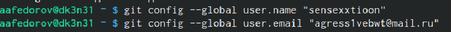
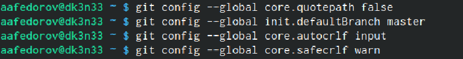
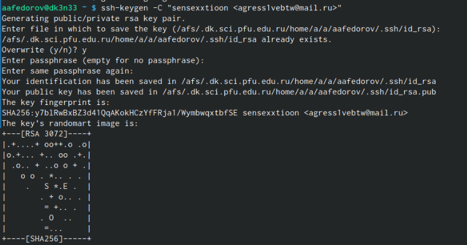
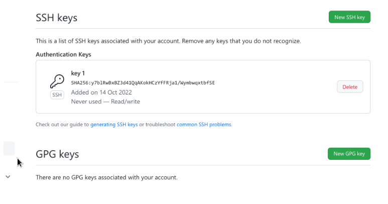
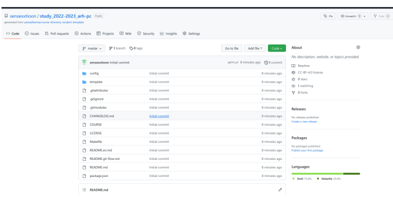
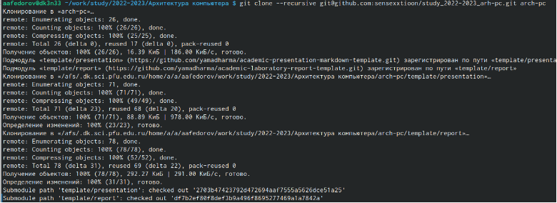
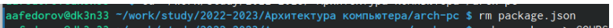
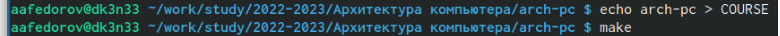
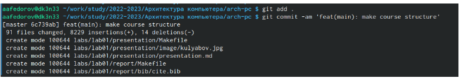
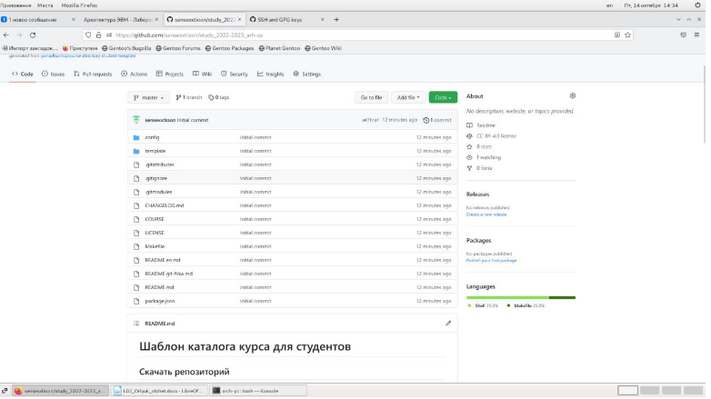

---
## Front matter
title: "Отчёт по лаболаторной работе номер 3"
subtitle: "Архитектура программирования"
author: "Федоров Андрей Андреевич"

## Generic otions
lang: ru-RU
toc-title: "Содержание"

## Bibliography
bibliography: bib/cite.bib
csl: pandoc/csl/gost-r-7-0-5-2008-numeric.csl

## Pdf output format
toc: true # Table of contents
toc-depth: 2
lof: true # List of figures
lot: true # List of tables
fontsize: 12pt
linestretch: 1.5
papersize: a4
documentclass: scrreprt
## I18n polyglossia
polyglossia-lang:
  name: russian
  options:
	- spelling=modern
	- babelshorthands=true
polyglossia-otherlangs:
  name: english
## I18n babel
babel-lang: russian
babel-otherlangs: english
## Fonts
mainfont: PT Serif
romanfont: PT Serif
sansfont: PT Sans
monofont: PT Mono
mainfontoptions: Ligatures=TeX
romanfontoptions: Ligatures=TeX
sansfontoptions: Ligatures=TeX,Scale=MatchLowercase
monofontoptions: Scale=MatchLowercase,Scale=0.9
## Biblatex
biblatex: true
biblio-style: "gost-numeric"
biblatexoptions:
  - parentracker=true
  - backend=biber
  - hyperref=auto
  - language=auto
  - autolang=other*
  - citestyle=gost-numeric
## Pandoc-crossref LaTeX customization
figureTitle: "Рис."
tableTitle: "Таблица"
listingTitle: "Листинг"
lofTitle: "Список иллюстраций"
lotTitle: "Список таблиц"
lolTitle: "Листинги"
## Misc options
indent: true
header-includes:
  - \usepackage{indentfirst}
  - \usepackage{float} # keep figures where there are in the text
  - \floatplacement{figure}{H} # keep figures where there are in the text
---

# Цель работы

Изучить идеологию и применение средств контроля версий. Приобрести практические навыки по работе с системой git

# Задание

1. Создайте отчет по выполнению лабораторной работы в соответствующем
каталоге рабочего пространства (labs>lab03>report).
2. Скопируйте отчеты по выполнению предыдущих лабораторных работ в
соответствующие каталоги созданного рабочего пространства.
3. Загрузите файлы на github.

# Выполнение лабораторной работы

1. Сначала сделаем предварительную конфигурацию git. Откроем терминал и введем следующие команды, указав свое имя и email: [-@fig:001]

{ #fig:001 width=90% }

2. Настроим utf-8 в выводе сообщений git,Зададим имя начальной ветки (будем называть её master), Параметр autocrlf, Параметр safecrlf: (рис. [-@fig:002])

{ #fig:002 width=90% }

3. Сгенерируем пару ключей (рис. [-@fig:003])

{ #fig:003 width=90% }

4. Далее необходимо загрузить сгенерённый открытый ключ. Зайдем на сайт http://github.org. Скопируем из локальной консоли ключ в буфер обмена (рис. [-@fig:004])

{ #fig:004 width=90% }

5. Создадим каталог для предмета «Архитектура компьютера» [-@fig:005]

{ #fig:005 width=90% }

6. Перейдем на станицу репозитория с шаблоном курса. В открывшемся окне задаем имя репозитория (рис. [-@fig:006])

{ #fig:006 width=90% }

7. Откроем терминал и перейдем в каталог курса (рис. [-@fig:007])

{ #fig:007 width=90% }

8. Клонируем созданный репозиторий (рис. [-@fig:008])

{ #fig:008 width=90% }

9. Перейдем в каталог курса [-@fig:009]

{ #fig:009 width=90% }

10. Удалим лишние файлы (рис. [-@fig:010])

{ #fig:010 width=90% }

11. Создадим необходимые каталоги (рис. [-@fig:011])

{ #fig:011 width=90% }

12. Отправим файлы на сервер (рис. [-@fig:012])

{ #fig:012 width=90% }

13. Проверим правильность создания иерархии рабочего пространства в локальном репозитории и на странице githubpc (рис. [-@fig:013])

{ #fig:013 width=90% }

# Выводы

Я изучил идеологию и применение средств контроля версий и приобрел практические навыки по работе с системой git

# Список литературы{.unnumbered}

::: {#refs}
:::
