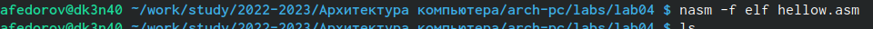

---
## Front matter
title: "Отчёт по лабораторной работе №4"
subtitle: "Архитектура вычислительных систем"
author: "Федоров Андрей Андреевич"

## Generic otions
lang: ru-RU
toc-title: "Содержание"

## Bibliography
bibliography: bib/cite.bib
csl: pandoc/csl/gost-r-7-0-5-2008-numeric.csl

## Pdf output format
toc: true # Table of contents
toc-depth: 2
lof: true # List of figures
lot: true # List of tables
fontsize: 12pt
linestretch: 1.5
papersize: a4
documentclass: scrreprt
## I18n polyglossia
polyglossia-lang:
name: russian
options:
- spelling=modern
- babelshorthands=true
polyglossia-otherlangs:
name: english
## I18n babel
babel-lang: russian
babel-otherlangs: english
## Fonts
mainfont: PT Serif
romanfont: PT Serif
sansfont: PT Sans
monofont: PT Mono
mainfontoptions: Ligatures=TeX
romanfontoptions: Ligatures=TeX
sansfontoptions: Ligatures=TeX,Scale=MatchLowercase
monofontoptions: Scale=MatchLowercase,Scale=0.9
## Biblatex
biblatex: true
biblio-style: "gost-numeric"
biblatexoptions:
- parentracker=true
- backend=biber
- hyperref=auto
- language=auto
- autolang=other*
- citestyle=gost-numeric
## Pandoc-crossref LaTeX customization
figureTitle: "Рис."
tableTitle: "Таблица"
listingTitle: "Листинг"
lofTitle: "Список иллюстраций"
lotTitle: "Список таблиц"
lolTitle: "Листинги"
## Misc options
indent: true
header-includes:
- \usepackage{indentfirst}
- \usepackage{float} # keep figures where there are in the text
- \floatplacement{figure}{H} # keep figures where there are in the text
---

# Цель работы

Освоение процедуры компиляции и сборки программ, написанных на ассем-
блере NASM.

# Задание

1. В каталоге ~/work/arch-pc/lab05 с помощью команды cp создайте копию файла hello.asm с именем lab5.asm

2. С помощью любого текстового редактора внесите изменения в текст программы в файле lab5.asm так, чтобы вместо Hello world! на экран выводилась строка с вашими фамилией и именем.

3. Оттранслируйте полученный текст программы lab5.asm в объектныйфайл. Выполните компоновку объектного файла и запустите получившийся исполняемый файл.

4. Скопируйте файлы hello.asm и lab5.asm в Ваш локальный репозиторий в каталог ~/work/study/2022-2023/"Архитектура компьютера"/arch-pc/labs/lab05/. Загрузите файлы на Github.

# Теоретическое введение

# Выполнение лабораторной работы

1. Переходим в каталог lab04 и создаем текстовый файл hello.asm

{ #fig:001 width=90% }

2. Открываем этот файл в gedit и вводим текст.

{ #fig:002 width=90% }

3. Компилируем написанный текст с помощью следующей команды.

{ #fig:003 width=90% }

4. Компилируем файл hello.asm в obj.o и проверяем с помощью команды ls

{ #fig:004 width=90% }

5. Передаем объектный файл на обработку компоновщику для получения исполняемой программы.

{ #fig:005 width=90% }

6. С помощью команды main получаем переименованный файл.

{ #fig:006 width=90% }

7. Запускаем на выполнение созданный исполняемый файл.

{ #fig:007 width=90% }

8. С помощью команды cp создаем копию файла hello.asm с именем lab04.asm

{ #fig:008 width=90% }

9. C помощью редактора gedit вносим изменения в текст программы в файле lab04.asm. Вместо Hello World вводим свои имя и фамилию, транслируем полученный текст в объектный файл, выполняем его компоновку и запускаем получившийся исполняемый файл.

{ #fig:009 width=90% }

# Выводы

Мы познакомились с ассемблером NASM и освоили процедуры компиляции и сборки программ, которые на нем написаны.

# Список литературы{.unnumbered}

::: {#refs}
:::
