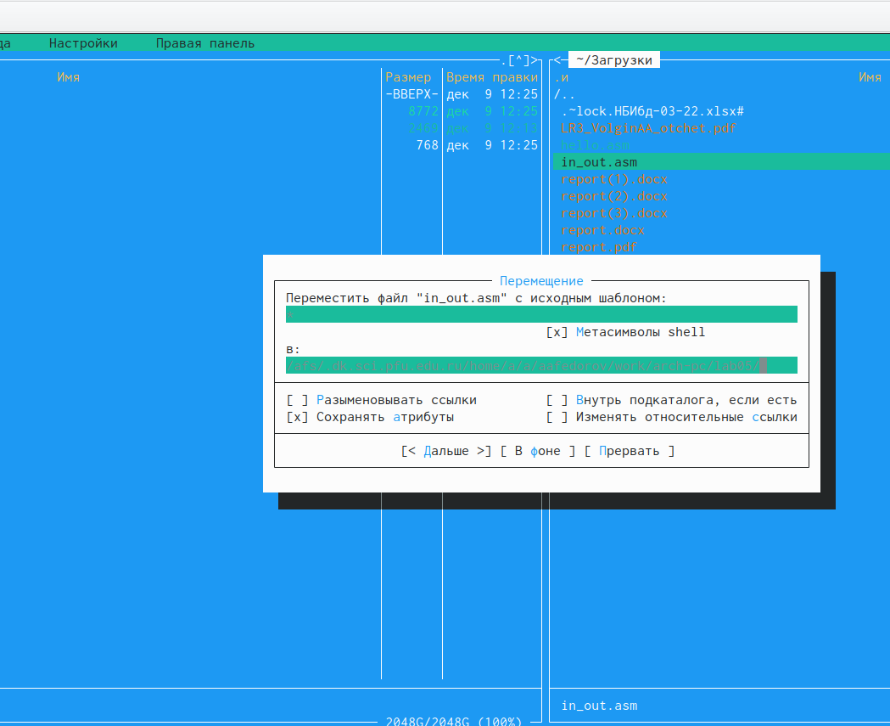

---
## Front matter
title: "Отчёт по лабораторной работе №5"
subtitle: "Архитектура вычислительных систем"
author: "Федоров Андрей Андреевич"

## Generic otions
lang: ru-RU
toc-title: "Содержание"

## Bibliography
bibliography: bib/cite.bib
csl: pandoc/csl/gost-r-7-0-5-2008-numeric.csl

## Pdf output format
toc: true # Table of contents
toc-depth: 2
lof: true # List of figures
lot: true # List of tables
fontsize: 12pt
linestretch: 1.5
papersize: a4
documentclass: scrreprt
## I18n polyglossia
polyglossia-lang:
name: russian
options:
- spelling=modern
- babelshorthands=true
polyglossia-otherlangs:
name: english
## I18n babel
babel-lang: russian
babel-otherlangs: english
## Fonts
mainfont: PT Serif
romanfont: PT Serif
sansfont: PT Sans
monofont: PT Mono
mainfontoptions: Ligatures=TeX
romanfontoptions: Ligatures=TeX
sansfontoptions: Ligatures=TeX,Scale=MatchLowercase
monofontoptions: Scale=MatchLowercase,Scale=0.9
## Biblatex
biblatex: true
biblio-style: "gost-numeric"
biblatexoptions:
- parentracker=true
- backend=biber
- hyperref=auto
- language=auto
- autolang=other*
- citestyle=gost-numeric
## Pandoc-crossref LaTeX customization
figureTitle: "Рис."
tableTitle: "Таблица"
listingTitle: "Листинг"
lofTitle: "Список иллюстраций"
lotTitle: "Список таблиц"
lolTitle: "Листинги"
## Misc options
indent: true
header-includes:
- \usepackage{indentfirst}
- \usepackage{float} # keep figures where there are in the text
- \floatplacement{figure}{H} # keep figures where there are in the text
---

# Цель работы

риобретение практических навыков работы в Midnight Commander. Освоение
инструкций языка ассемблера mov и int.

# Задание

1. Создайте копию файла lab6-1.asm. Внесите изменения в программу (без
использования внешнего файла in_out.asm), так чтобы она работала по
следующему алгоритму:
• вывести приглашение типа “Введите строку:”;
• ввести строку с клавиатуры;
• вывести введённую строку на экран

2. Получите исполняемый файл и проверьте его работу. На приглашение
ввести строку введите свою фамилию.

3. оздайте копию файла lab6-2.asm. Исправьте текст программы с исполь-
зование подпрограмм из внешнего файла in_out.asm, так чтобы она ра-
ботала по следующему алгоритму:
• вывести приглашение типа “Введите строку:”;
• ввести строку с клавиатуры;
• вывести введённую строку на экран.

4. Создайте исполняемый файл и проверьте его работу.

# Теоретическое введение

# Выполнение лабораторной работы

1. Я открыл mc, в каталог ~/work/arch-pc созданный при выполнении лабораторной работы No4, создал lab05

{ #fig:001 width=90% }

2. Пользуясь строкой ввода и командой touch создал файл lab5-1.asm 

{ #fig:002 width=90% }

3. Я открыл файл lab5-1.asm для редактирования во встроенном редакторе и проверил его

{ #fig:003 width=90% }

{ #fig:004 width=90% }

4. Ввёл текст программы из листинга 6.1, сохранил изменения и закрыл файл.

{ #fig:005 width=90% }

5. Я Оттранслировал текст программы lab5-1.asm в объектный файл. Выполните компоновку объектного файла и запустил получившийся исполняемый файл

{ #fig:006 width=90% }

6. Скачал и подключил in_out.asm

{ #fig:007 width=90% }

{ #fig:008 width=90% }

7. Создал копию файла lab6-1.asm с именем lab6-2.asm

{ #fig:009 width=90% }

8. Исправил текст программы в файле lab6-2.asm с использованием подпрограмм из внешнего файла in_out.asm

{ #fig:010 width=90% }

9. В lab6-2.asm заменил подпрограмму sprintLF на sprint, создал исполняемый фаил и выявил разницу - она заключается в выводе текста (отступ для ввода либо пробелом, либо новой строчкой)

{ #fig:011 width=90% }

10. Я создал копию файла lab6-1.asm и внёс изменения в программу

{ #fig:012 width=90% }

11. Я получил исполняемый фаил и проверил его работу

{ #fig:013 width=90% }

12. Создал копию файла lab6-2.asm. Исправил текст программы с использование подпрограмм из внешнего файла in_out.asm

{ #fig:014 width=90% }

{ #fig:015 width=90% }

12. Создал исполняемый фаил и проверил его работу

{ #fig:016 width=90% }

# Выводы

Мы приобрели практические навыкови работы в Midnight Commander. И освоили иструкции языка ассемблера mov и int.

# Список литературы{.unnumbered}

::: {#refs}
:::
