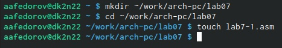
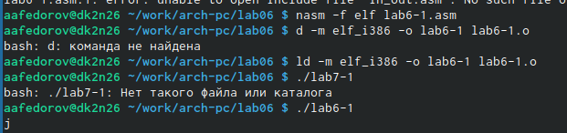
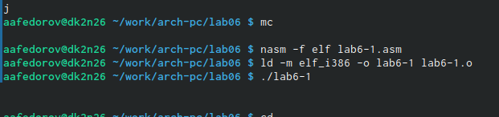
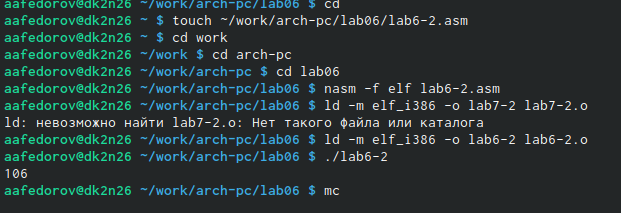
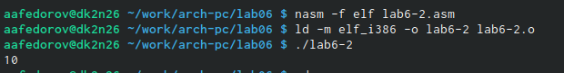
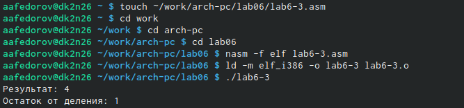
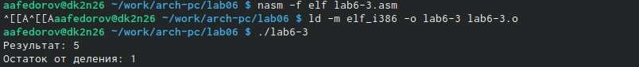
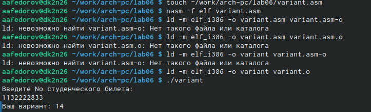

---
## Front matter
title: "Отчёт по лабораторной работе №6"
subtitle: "Архитектура вычислительных систем"
author: "Федоров Андрей Андреевич"

## Generic otions
lang: ru-RU
toc-title: "Содержание"

## Bibliography
bibliography: bib/cite.bib
csl: pandoc/csl/gost-r-7-0-5-2008-numeric.csl

## Pdf output format
toc: true # Table of contents
toc-depth: 2
lof: true # List of figures
lot: true # List of tables
fontsize: 12pt
linestretch: 1.5
papersize: a4
documentclass: scrreprt
## I18n polyglossia
polyglossia-lang:
name: russian
options:
- spelling=modern
- babelshorthands=true
polyglossia-otherlangs:
name: english
## I18n babel
babel-lang: russian
babel-otherlangs: english
## Fonts
mainfont: PT Serif
romanfont: PT Serif
sansfont: PT Sans
monofont: PT Mono
mainfontoptions: Ligatures=TeX
romanfontoptions: Ligatures=TeX
sansfontoptions: Ligatures=TeX,Scale=MatchLowercase
monofontoptions: Scale=MatchLowercase,Scale=0.9
## Biblatex
biblatex: true
biblio-style: "gost-numeric"
biblatexoptions:
- parentracker=true
- backend=biber
- hyperref=auto
- language=auto
- autolang=other*
- citestyle=gost-numeric
## Pandoc-crossref LaTeX customization
figureTitle: "Рис."
tableTitle: "Таблица"
listingTitle: "Листинг"
lofTitle: "Список иллюстраций"
lotTitle: "Список таблиц"
lolTitle: "Листинги"
## Misc options
indent: true
header-includes:
- \usepackage{indentfirst}
- \usepackage{float} # keep figures where there are in the text
- \floatplacement{figure}{H} # keep figures where there are in the text
---

# Цель работы

Освоение арифметических инструкций языка ассемблера NASM.

# Теоретическое введение

# Выполнение лабораторной работы

1. Создаём каталог для программ лаболаторной работы номер 7

{ #fig:001 width=90% }

2. Я просмотрел и ввёл программу для вывода значения регистра ax

{ #fig:002 width=90% }

3. Я изменил текст программы и вместо символов записал в регистры числа, далее их заменил и увидел результат

{ #fig:003 width=90% }

4. Тоже самое проделал в файле lab6-2.asm, но проверял вывод eax

{ #fig:004 width=90% }

5. Я изменил значение вывода

{ #fig:005 width=90% }

6. Я решил уравнение f(x) = (5*2+3)/3, f(x) = (4*6+2)/5

{ #fig:006 width=90% }

{ #fig:007 width=90% }

7. Я вывел запрос на введение студ.билета, вычислил номер варианта по формуле (𝑆𝑛 mod 20) + 1, где 𝑆𝑛 –
номер студенческого билета, вывел на экран номер варианта

{ #fig:008 width=90% }

8. 

1) Какие строки листинга 7.4 отвечают за вывод на экран сообщения ‘Ваш
вариант:’?

mov eax,rem call sprint

2) Для чего используется следующие инструкции? nasm mov ecx, x
mov edx, 80 call sread

mov ecx, x - запись входной переменной в регистр ecx;
mov edx, 80 - запись размера перемнной в регистр edx; call
sread - вызов процедуры чтония данных;

3) Для чего используется инструкция “call atoi”?

Вызов atoi – функции преобразующей ascii-код символа в целое число
и записывающий результат в регистр eax.

4) Какие строки листинга 7.4 отвечают за вычисления варианта?

xor edx,edx mov ebx,20 div ebx inc edx

5) В какой регистр записывается остаток от деления при выполнении ин-
струкции “div ebx”?

В регистр ebx.

6) Для чего используется инструкция “inc edx”?

Инструкция INC используется для увеличения операнда на единицу.

7) Какие строки листинга 7.4 отвечают за вывод на экран результата вычис-
лений?

mov eax,rem call sprint mov eax,edx call iprintLF

# Выводы

Мы познакомились с ассемблером NASM и освоили арифмитические инструкции языка.

# Список литературы{.unnumbered}

::: {#refs}
:::
